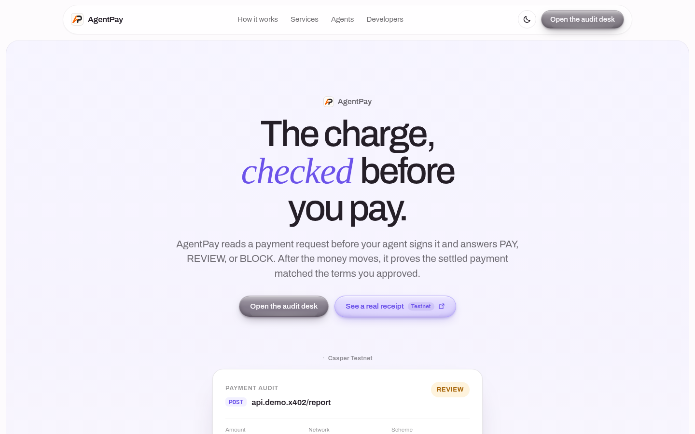
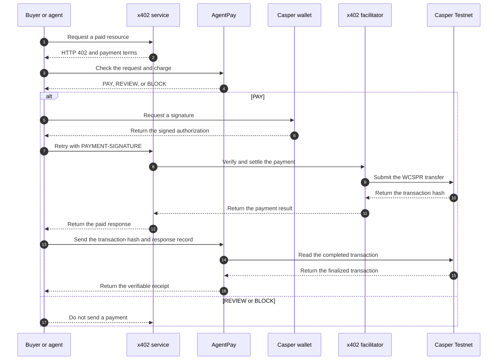
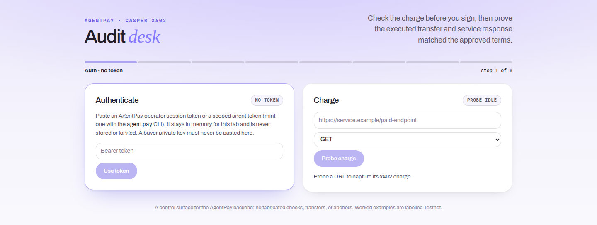
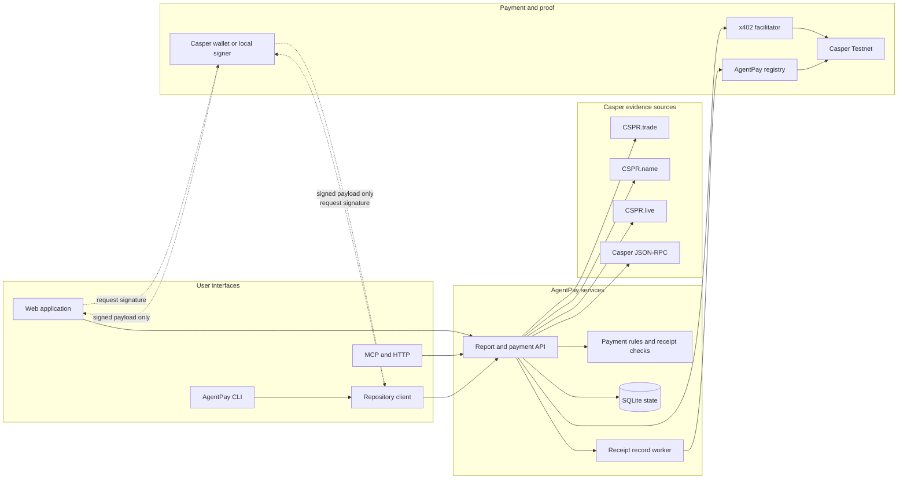

<div align="center">


<h1>AgentPay</h1>

**Check a Casper x402 charge before the buyer signs it. Prove the result after payment.**

[](https://agentpay.timidan.xyz)
[](https://cspr.live)
[](https://agentpay.timidan.xyz)
[](#connect-an-agent)
[](https://www.typescriptlang.org)
[](https://react.dev)
[](https://nodejs.org)

[Live demo](https://agentpay.timidan.xyz) | [Demo transcript](docs/live-demo-transcript.md) | [How AgentPay works](#how-agentpay-works) | [Agent integration](#connect-an-agent) | [Local setup](#run-agentpay-locally) | [Testnet proof](#verified-testnet-proof)



<p><strong>Built on Casper. Connected to the services below.</strong></p>

<p>
  
  &nbsp;&nbsp;&nbsp;&nbsp;
  
  &nbsp;&nbsp;&nbsp;&nbsp;
  
  &nbsp;&nbsp;&nbsp;&nbsp;
  
  &nbsp;&nbsp;&nbsp;&nbsp;
  
</p>

</div>

## Purpose

AgentPay checks a Casper x402 charge before the buyer signs it. It checks these
items:

- The service.
- The payment destination.
- The token and amount.
- The payment details.
- The buyer's payment rules.

AgentPay returns **PAY**, **REVIEW**, or **BLOCK**. A PAY decision does not send
funds. The buyer signs and sends the payment from its own wallet.

After payment, AgentPay reads the Casper transaction. It compares the transfer
with the approved charge. It also records the service response. AgentPay then
creates a receipt that users can verify.

The payment API does not read or store the buyer's private key.

AgentPay also provides token and account checks. These checks buy current Casper
evidence through x402. They use the same payment checks and settlement checks.

## Terms

| Term | Meaning |
|---|---|
| **Buyer** | The person, agent, or program that pays for a service. |
| **Service** | The HTTP service that returns the x402 payment request. |
| **Charge** | The payment terms in the HTTP 402 response. |
| **Facilitator** | The service that verifies the signed payment and submits it to Casper. |
| **Settlement** | The completed token transfer on Casper. |
| **Receipt** | The AgentPay record that connects the request, decision, settlement, and service response. |

## How AgentPay works

1. The service returns HTTP 402 and a `PAYMENT-REQUIRED` header.
2. The buyer sends the request and charge to AgentPay.
3. AgentPay applies the provider, token, amount, and payment rules.
4. The buyer can sign the payment only after a PAY decision.
5. AgentPay checks the completed Casper transaction and service response.
6. AgentPay creates a receipt. It can also record the receipt hash on Casper.

### Payment sequence



The receipt contains these records:

- The original HTTP request.
- The normalized payment terms.
- The payment-policy version.
- The provider decision.
- The prepared payment details.
- The Casper settlement proof.
- The observed service response.

Use `agentpay receipt verify` to verify a receipt without a network connection.

<div align="center">

<br />
<sub>The payment checker shows each step from the charge to the Casper receipt record.</sub>
</div>

## Ways to use AgentPay

| User | Interface | Main task |
|---|---|---|
| **Agent** | MCP, HTTP, or the repository client | Check a charge, sign after PAY, and verify the result. |
| **Person** | Web application | Read a charge, manage payment rules, and verify receipts. |
| **Developer** | `agentpay` CLI | Run checked calls and manage provider and payment rules. |
| **Evidence user** | Token, account, and report pages | Buy a Casper evidence check through the same payment process. |

See [docs/user-surfaces.md](docs/user-surfaces.md) for all pages, commands,
endpoints, and credentials.

## Payment decisions

| Decision | Meaning |
|---|---|
| **PAY** | The charge and prepared payment details match all configured rules. The buyer can choose to sign. |
| **REVIEW** | AgentPay needs an operator decision or more evidence. AgentPay does not send the payment. |
| **BLOCK** | A required rule failed. AgentPay does not send the payment. |

AgentPay can return BLOCK for these conditions:

- The provider is denied.
- The payment destination changed.
- The charge uses the wrong token.
- The amount is above the payment limit.
- The payment details were already used.
- The token evidence shows a required risk.

## Evidence results

AgentPay uses the same rules for the web application, CLI, and agent tools. The
rules are in `packages/agent-pay-core`.

| Result | Meaning |
|---|---|
| **CLEAR** | AgentPay read all required facts. All required checks passed. |
| **CAUTION** | AgentPay found a warning, or it could not run a required check. |
| **DANGER** | A required check found a specific risk. |

Each result has three lists:

- **Flags:** Checks that found a risk or warning.
- **Passed:** Required checks that completed without a problem.
- **Not checked:** Required facts that AgentPay could not read.

AgentPay does not mark an unavailable check as passed.

## System design

AgentPay is an npm-workspaces monorepo.

### Service architecture



| Component | Function |
|---|---|
| `apps/web` | React 19 web application. |
| `apps/report-api` | Payment-check and evidence API. It stores durable state in SQLite. |
| `apps/cli` | Command-line interface for checks, calls, rules, and receipts. |
| `apps/mcp-server` | MCP stdio server and HTTP bridge. |
| `packages/agent-pay-client` | HTTP client, local Casper signer, and checked-call process. |
| `packages/agent-pay-core` | Data formats, payment rules, settlement checks, and receipt verification. |
| `contracts/agent-pay-registry` | Rust and Wasm contract for append-only receipt records. |

`packages/agent-pay-core` has no network access and no key access. Tests can
supply all external data to this package.

AgentPay uses these live data sources:

- **Casper JSON-RPC:** Reads contract state, token supply, and transactions.
- **CSPR.live:** Reads public holder and contract-history data.
- **CSPR.trade:** Resolves listed symbols and reads exact pool data.
- **CSPR.name:** Resolves human-readable Mainnet account names.
- **CSPR.cloud:** Provides a hosted x402 facilitator. Token discovery is optional.

AgentPay can also use the open-source `casper-x402` facilitator on its own
server.

## Run AgentPay locally

Install Node.js 22.13 or a later version.

```bash
npm install
npm run dev
```

The command starts these services:

- Report API: `http://127.0.0.1:4021`
- MCP bridge: `http://127.0.0.1:3001`
- Web application: `http://localhost:5173`

The localhost addresses are only for local development. The public application
is [agentpay.timidan.xyz](https://agentpay.timidan.xyz).

Without payment credentials, the local application stops at the x402 payment
request. It reports that the signing key is not configured. It does not create
a false payment result.

Use these commands to check the repository:

```bash
npm test
npm run build
npm run smoke
```

`npm test` runs the workspace, script, and Rust contract tests. `npm run build`
builds all workspaces and the registry Wasm. `npm run smoke` starts the report
API and checks its capability endpoints.

The contract build also requires Rust and `binaryen`. See
[Deploy the registry contract](#deploy-the-registry-contract).

## Connect an agent

Agents can use MCP stdio or the hosted HTTP bridge.

AgentPay publishes these npm packages:

| Package | Use |
|---|---|
| [`@timidan/agentpay-mcp`](https://www.npmjs.com/package/@timidan/agentpay-mcp) | Connect an MCP client to the AgentPay tools. |
| [`@timidan/agentpay-cli`](https://www.npmjs.com/package/@timidan/agentpay-cli) | Create tokens, check charges, verify settlements, and read receipts. |

Use Node.js 22 or a later version. The workspace package `@agent-pay/client`
is repository code. It is not a published npm package.

Use this MCP configuration:

```json
{
  "mcpServers": {
    "agent-pay": {
      "command": "npx",
      "args": ["--yes", "@timidan/agentpay-mcp"],
      "env": {
        "AGENT_PAY_API_TOKEN": "<scoped-agent-token>"
      }
    }
  }
}
```

The MCP package uses `https://agentpay.timidan.xyz/api` by default.

Call this tool to test the connection without a token or payment:

```json
{
  "name": "quote_report",
  "arguments": {
    "subject": "WCSPR",
    "evidenceNetwork": "casper-testnet"
  }
}
```

A successful result contains `quoteId`, `paymentRequirements`, and
`paymentReadiness`. This call does not sign or settle a payment.

Public quote, payment-status, and proof-verification operations do not need an
AgentPay token. A paid token or account check needs a local Testnet buyer key
and registry configuration. The key stays in the MCP process.

Create a payer-bound token before you use the protected payment tools:

```bash
npm install --global @timidan/agentpay-cli
agentpay agent-token issue \
  --name my-agent \
  --key ./testnet_secret_key.pem \
  --json
```

If you omit `--scope`, the CLI grants `checks:write`, `settlements:write`,
`observations:write`, and `receipts:read`. Put the returned token in
`AGENT_PAY_API_TOKEN` in the MCP configuration.

To use the hosted bridge, send a POST request to this URL:

```text
https://agentpay.timidan.xyz/bridge/tools/<tool-name>
```

Add this header for a protected tool:

```text
Authorization: Bearer <bridge-token>
```

For a public deployment, set `MCP_SERVER_AUTH_TOKEN` to at least 32 random
characters. Readiness endpoints remain public.

Set `MCP_PUBLIC_TESTNET_ASSESSMENTS=1` only when the public web application must
use `assess_subject` and `assess_account`. This mode has Testnet-only payment
limits, client limits, daily limits, and an exact browser-origin list. All other
protected HTTP tools still require the bridge token.

### MCP tools

| Tool | Function |
|---|---|
| `quote_report` | Get the price, evidence network, dataset root, and x402 terms. |
| `payment_status` | Check the payment token, destination, facilitator, and network. |
| `registry_status` | Check the registry contract, recorder account, and RPC. |
| `buy_report` | Send the signed `PAYMENT-SIGNATURE` and get the paid report. |
| `verify_report` | Verify the report and Merkle proof. |
| `record_decision` | Record `approved`, `needs_review`, or `rejected` on Casper. |
| `assess_subject` | Resolve, buy, verify, score, and record a token check. |
| `assess_account` | Run the same process for an account or CSPR.name. |
| `check_x402_payment` | Return PAY, REVIEW, or BLOCK before the buyer signs. |
| `verify_x402_settlement` | Compare a Casper transaction with the approved terms. |
| `get_payment_receipt` | Get the receipt and its current Casper record status. |

Check `payment_status` and `registry_status` before you use a tool that writes
data. For a manual report purchase, run `npm run x402:buy`. Send only the signed
payment payload to `buy_report`.

## Configure AgentPay

Evidence reads and payment checks do not need a server-side buyer key. The
buyer signs in the client, CLI, or wallet. The registry uses a separate recorder
key.

Do not commit credentials. Put local values in a local `.env` file or process
environment.

| Variable | Function |
|---|---|
| `CASPER_RPC_URL` | Read chain state and confirm transactions. |
| `AGENTPAY_DEFAULT_EVIDENCE_NETWORK` | Select `casper-mainnet` or `casper-testnet` for evidence reads. |
| `AGENTPAY_MAINNET_RPC_URL` / `AGENTPAY_TESTNET_RPC_URL` | Set the read-only RPC for each evidence network. |
| `CASPER_SECRET_KEY_PATH` | Set the local buyer key. The payment API must not read this key. |
| `X402_ASSET_PACKAGE_HASH` | Set the raw 64-character CEP-18 package hash. |
| `PAYEE_ADDRESS` | Set the `00`-prefixed account that receives payment. |
| `X402_FACILITATOR_URL` | Set the hosted or self-hosted x402 facilitator URL. |
| `X402_FACILITATOR_AUTH_TOKEN` | Set the credential for the hosted facilitator. |
| `AGENT_PAY_REGISTRY_PACKAGE_HASH` | Set the deployed registry package hash. |
| `AGENT_PAY_REGISTRY_CONTRACT_HASH` | Set the active contract hash for receipt readback. |
| `AGENT_PAY_REGISTRY_RECORDER_ACCOUNT_HASH` | Set the separate recorder account hash. |
| `AGENT_PAY_REGISTRY_RECORDER_KEY_PATH` | Set the separate key for receipt records. |
| `AGENT_PAY_API_TOKEN` | Set the scoped token for agent, CLI, or MCP checks. |
| `AGENTPAY_DATABASE_PATH` | Set the persistent SQLite file path. |
| `AGENTPAY_PUBLIC_ORIGIN` | Set the public HTTPS origin. Authentication challenges use this value. |
| `AGENTPAY_ALLOWED_ORIGINS` | Set the exact browser origins that can call the report API. |
| `MCP_SERVER_AUTH_TOKEN` | Protect the HTTP bridge with at least 32 random characters. |
| `MCP_ALLOWED_ORIGINS` | Set the exact browser origins that can call the HTTP bridge. |
| `MCP_PUBLIC_TESTNET_ASSESSMENTS` | Set to `1` only for limited public Testnet checks. |
| `VITE_AGENTPAY_SERVICE_URL` | Set a different public AgentPay service for the one-click WCSPR process. |
| `CSPR_NAME_API_BASE_URL` | Set the CSPR.name API URL. |
| `CSPR_LIVE_MAINNET_API_URL` / `CSPR_LIVE_TESTNET_API_URL` | Set different CSPR.live API URLs. |
| `CSPR_CLOUD_ACCESS_TOKEN` | Set the optional CSPR.cloud token-discovery credential. |
| `CSPR_CLOUD_SUBJECT_ACCESS_TOKEN` | Set a separate credential for CSPR.cloud subject evidence. |

The hosted CSPR.cloud facilitator uses official Testnet WCSPR. Use a dedicated
`X402_FACILITATOR_AUTH_TOKEN`. Do not use a shared documentation credential for
continuous public traffic.

### Use the CLI

Install the [published CLI package](https://www.npmjs.com/package/@timidan/agentpay-cli):

```bash
npm install -g @timidan/agentpay-cli
```

Run these commands as required:

```bash
agentpay check --file payment-request.json --json
agentpay call --url https://service.example/resource --key ./buyer_secret_key.pem --json
agentpay verify-settlement --check <check-id> --tx <transaction-hash> --json
agentpay receipt show --id <receipt-id> --json
agentpay receipt verify --file receipt.json --json
```

The `payment-request.json` file must contain the captured request, the exact
x402 `PAYMENT-REQUIRED` body, the prepared authorization or `null`, and an
idempotency key. Read the npm package page for a complete JSON example.

The check output contains `check.id`, `check.decision.verdict`, and the decision
reasons. The CLI uses these exit codes:

| Code | Result |
|---|---|
| `0` | `PAY`, settlement `match`, or success. |
| `2` | `REVIEW` or settlement `pending`. |
| `3` | `BLOCK` or settlement `mismatch`. |
| `4` | Invalid input, unavailable result, or command error. |

Create an operator session before you change rules or agent tokens:

```bash
agentpay session create --key ./testnet_secret_key.pem --json
agentpay agent-token issue --name my-agent --key ./testnet_secret_key.pem --json
agentpay agent-token list --session-token <operator-session-token> --json
```

The CLI reads the secret key locally. It does not send the key to AgentPay.
Keep session tokens and agent tokens out of shell history, logs, and source
control.

The CLI uses `https://agentpay.timidan.xyz/api` by default. Use `--api-url` for
a different deployment.

### Fix package errors

- If npm reports an engine error, install Node.js 22 or later.
- If a protected command returns `401`, create a new agent token.
- If a protected command returns `403`, add the required scope. Also confirm
  that the token is used with its bound payer key.
- If settlement is not ready, call `payment_status`. Read its reason field.
- Do not put a Casper key, agent token, or bridge token in source control.

## Buy an x402 report

AgentPay uses x402 version 2 headers:

1. The report API returns `PAYMENT-REQUIRED`.
2. The buyer retries with `PAYMENT-SIGNATURE`.
3. The settled response includes `PAYMENT-RESPONSE`.

AgentPay releases a report only after all of these checks pass:

- The facilitator verifies the payment.
- The facilitator returns a raw 64-character settlement hash.
- Casper RPC confirms that the transaction completed.
- The completed transfer matches the signed payment.

The buyer code is in [scripts/x402-buyer.ts](scripts/x402-buyer.ts) and
[scripts/x402-buy.ts](scripts/x402-buy.ts).

The buyer creates an EIP-712 `TransferWithAuthorization` digest. It uses the
official `@casper-ecosystem/casper-eip-712` package. It uses the Casper x402
signature format that the facilitator verifies:

- secp256k1: `0x02 || ECDSA(sha256(digest))`
- ed25519: `0x01 || ed25519(digest)`

Run a purchase:

```bash
REPORT_API_URL=https://agentpay.timidan.xyz/api \
AGENT_PAY_SUBJECT=hash-<64-hex-package-hash> \
CASPER_SECRET_KEY_PATH=.agentpay-testnet-key/funded_secret_key.pem \
npm run x402:buy
```

The command gets current evidence, signs the payment, and gets the report. It
also prints the confirmed settlement transaction. If configuration is missing,
it prints the exact missing item.

## Deploy AgentPay

Use the production files in [deploy/agentpay](deploy/agentpay/README.md).

The standard deployment has these parts:

- Nginx serves the web build.
- The report API listens only on `127.0.0.1:4021`.
- The MCP bridge listens only on `127.0.0.1:3001`.
- Nginx exposes the report API at `/api/`.
- Nginx exposes the MCP bridge at `/bridge/`.
- SQLite data stays in `/var/lib/agentpay`.

AgentPay can share a host with another application. Give AgentPay a separate
service account, environment file, process, and database.

The standard web build uses the same origin for `/api` and `/bridge`. Do not set
`VITE_REPORT_API_URL`, `VITE_MCP_SERVER_URL`, or `VITE_AGENTPAY_SERVICE_URL` for
this deployment. Use these variables only for an intentional split-origin HTTPS
deployment.

Nginx must terminate TLS. The Node services must not listen on a public network
interface.

After deployment, run this check:

```bash
pnpm production:check
```

## Deploy the registry contract

Build the registry Wasm:

```bash
npm run build:contract
```

Do not replace this command with `cargo build`. New Rust toolchains can create
Wasm operations that the Casper engine does not accept.

The build script performs these actions:

1. It disables `bulk-memory` operations.
2. It lowers `sign-ext` and nontrapping floating-point operations to Wasm MVP.
3. It removes extra Wasm metadata.
4. It stops if a non-MVP operation remains.

Install `binaryen` so that `wasm-opt` is on `PATH`:

```bash
npm install --global binaryen
```

Create separate Testnet buyer and recorder keys:

```bash
cargo install casper-client
casper-client keygen .agentpay-testnet-key
casper-client keygen .agentpay-registry-recorder-key
npm run submission:funding
casper-client account-address --public-key .agentpay-registry-recorder-key/public_key_hex
```

Fund both accounts with the [Casper Testnet faucet](https://testnet.cspr.live/tools/faucet).

Set these values:

- Set `CASPER_SECRET_KEY_PATH` to the buyer key.
- Set `AGENT_PAY_REGISTRY_RECORDER_KEY_PATH` to the recorder key.
- Set `AGENT_PAY_REGISTRY_RECORDER_ACCOUNT_HASH` to the recorder account.

Deploy the contract:

```bash
npm run submission:deploy-registry
```

Record the install hash, package hash, and active contract hash.

The contract has these entry points:

- `record_purchase_receipt` records an append-only receipt.
- `set_recorder` changes the recorder account. Only the owner can use it.
- Receipt readback gets a stored receipt record.
- `record_decision_with_root` records the qualification decision.

Do not put private key data in environment files, chat, documentation, or
source control.

## Verified Testnet proof

AgentPay has completed real Testnet payments through the hosted CSPR.cloud
facilitator and the self-hosted open-source facilitator. These records are not
fixtures.

| Record | Casper hash |
|---|---|
| Registry v2 install | `2c53ec7d38757c7c252fa16acc4c099d1c53136c852f908821989ac42f0fa4e6` |
| Registry v2 package | `hash-050b717617b9c79535983d9e0cc2ba21dd379ce3450498601dba64324a2dcd1a` |
| Registry v2 contract | `hash-b5e129dca5548f1bbe225db73042d08ab5b35cc976c3ac955bf2fe2a8cd92ee3` |
| Official Testnet WCSPR package | `hash-3d80df21ba4ee4d66a2a1f60c32570dd5685e4b279f6538162a5fd1314847c1e` |
| Hosted CSPR.cloud report settlement | `31d7fb7fe45430d4af99c56e9dda536ce4c7306c0296f3d87fc0febd771adb86` |
| Hosted desktop checked-call settlement | `28048959f0e059dbc4b0b69f0d99d41bdcd19e05b72128fbbf0442ac3c185c98` |
| Hosted desktop receipt record | `ad6dfb831d4fb8273d8c54d41ea9e2ad48e1d94aea18b94006ee3b94a7470b87` |
| Hosted mobile checked-call settlement | `e5b5bd3cb72347246de27979f889ca62c66503696ab16e5cc3cc99cd89130b69` |
| Hosted mobile receipt record | `eb557178a60c5b06ecf10ea3efb5d8c4e0a236fec6c4a7f8da826d33c94fdb1d` |
| Self-hosted fallback checked-call settlement | `d3b1493c0175ede67151dba32ccc7a0da7275eb99f380e3a28aa244c984e2eac` |
| Self-hosted fallback receipt record | `ae5986c22a2b92db5d594d77c7a7a169649597be973ce6240bb1aa978b053492` |
| Qualification decision record | `da99d2cd3f23fbd9e9369c57d9a7442219ea746812a143e29fdbd28b7b43216b` |

## Product limits

See [docs/live-capabilities.md](docs/live-capabilities.md) for the current
product boundary.

- AgentPay runs payment and registry writes on Casper Testnet.
- AgentPay does not have a Mainnet deployment.
- AgentPay does not provide a facilitator availability guarantee.
- Continuous hosted CSPR.cloud use needs a project-specific credential.
- Public users can read health, quotes, payment status, and proof results.
- Configured Testnet credentials enable paid checks, settlement checks, and receipt records.
- `assess_account` can resolve a `.cspr` name and read the Mainnet account.
- Token checks use Casper RPC, CSPR.live, and CSPR.trade when each source is available.
- An unavailable fact has the result **not checked**.
- AgentPay does not claim support for custom token-authority models or LP-holder concentration.
- The repository does not contain false payment receipts or business-evidence records.

AgentPay results are automated evidence. They are not financial advice. A
receipt proves what AgentPay checked and what it decided. It does not prove that
all external information is true.

## Repository files

```text
apps/web                        React and Vite web application
apps/report-api                 Express payment and evidence API
apps/mcp-server                 MCP server and HTTP bridge
apps/cli                        AgentPay command-line interface
packages/agent-pay-client       Non-custodial client and local signer
packages/agent-pay-core         Payment rules and receipt verification
contracts/agent-pay-registry    Casper Wasm registry contract
scripts                         Development, test, deployment, and x402 tools
docs                            Product limits, system design, and demo instructions
```
